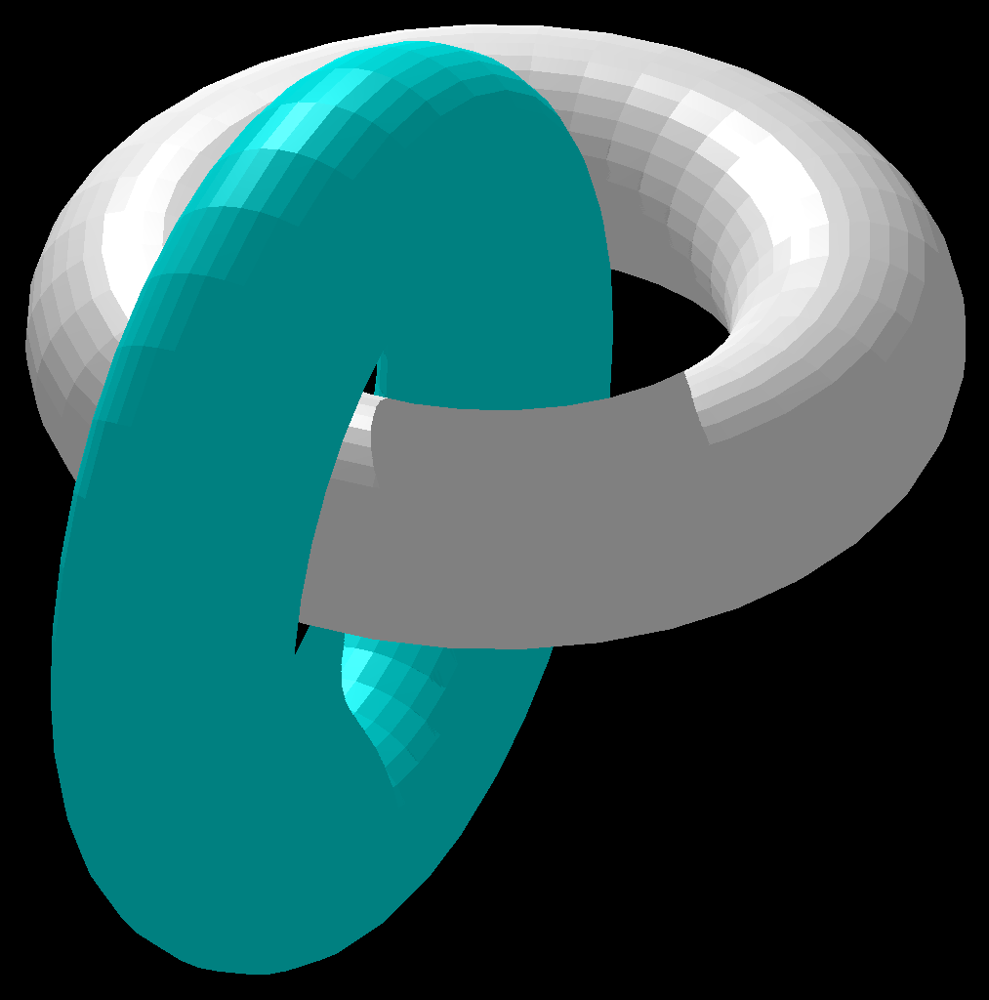

<h1 align="center">graphics-engine-cpp</h1>

<em>A project by Flor Ronsmans De Vry for the Computer Graphics course at the University of Antwerp.</em>

</img>

___

## Project goals
The goal of this project was to develop a graphics engine from the ground up in C++.

## Implement features
- Basic shapes
  - Diamond
  - Quarter circle
  - Chessboard
  - Eye
- L-systems
  - Basic L-systems
  - L-systems with brackets
  - Stochastic L-systems [stochastic-example.L2D](stochastic-example.L2D)
- 3D Lijntekeningen
- 3D Lichamen
- 3D L-Systemen
- Z-Buffering met lijnen
- Z-Buffering met driehoeken
- Fractals
  - Generic fractals
  - Buckyball (based on [this article](https://en.wikipedia.org/wiki/Truncated_icosahedron), not an icosahedron directly)
  - Menger sponge
- Lighting
  - Ambient lighting
  - Diffuse lighting (including spots)
  - Specular lighting
- Shadows